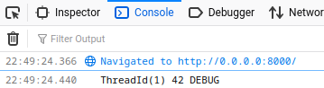

# Running the Example

To run the flow defined:

```js
import init, {parse_flow} from './pkg/flowrs_wasm.js'

// Always required for wasm
await init();

let json = `{
    "threads": 1,
    "duration": 3, 
    "nodes": [
        {
            "name": "lhs",
            "kind": "nodes.basic",
            "props": 12
        },
        {
            "name": "rhs",
            "kind": "nodes.basic",
            "props": 30
        },
        {
            "name": "add",
            "kind": "nodes.arithmetics.add",
            "props": {"none": "Undefined"}
        },
        {
            "name": "debug",
            "kind": "nodes.debug",
            "props": {"none": "Undefined"}
        }
    ],
    "edges": [
        {
            "source": {"node": "lhs", "index": 0},
            "dest": {"node": "add", "index": 0}
        },
        {
            "source": {"node": "rhs", "index": 0},
            "dest": {"node": "add", "index": 1}
        },
        {
            "source": {"node": "add", "index": 0},
            "dest": {"node": "debug", "index": 0}
        }
    ]
}`

// Calling first routine
parse_flow(json);
```

execute the following commands:

```sh
$ wasm-pack build --target web
$ python3 -m http.server
```

Open the browser at [http://0.0.0.0:8000/](http://0.0.0.0:8000/).

When enabling the developer tools you should see a debug like the following:



# Executing Tests

All Rust internal test can be executed using:

```sh
$ cargo test
```

while tests that require WASM can be executing using:

```sh
$ wasm-pack test --node
```
